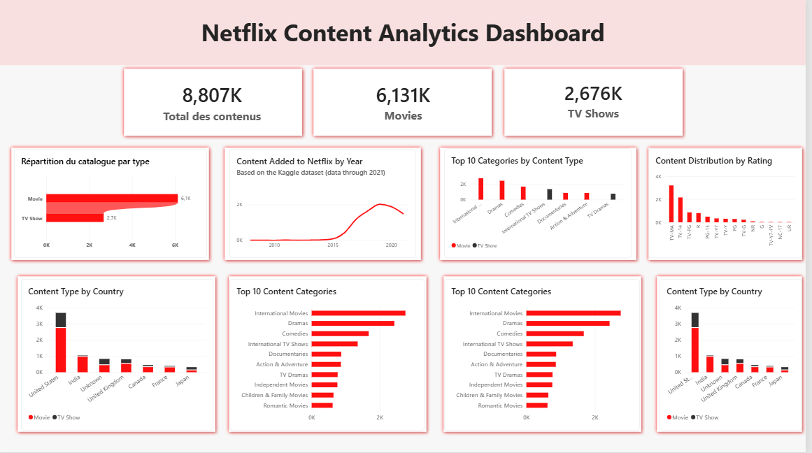

# 🎬 Netflix Content Analytics

> **An end-to-end Business Intelligence project exploring Netflix's content catalog through data exploration, data cleaning, relational database modeling, SQL analysis, and Power BI visualization.**



---

## 📌 Project Overview

How can raw content data be transformed into meaningful business insights?

This project explores the **Netflix Movies and TV Shows** dataset from Kaggle and follows an end-to-end Business Intelligence workflow, from data ingestion and quality assessment to database modeling, SQL analysis, and dashboard creation.

The project was built around the following approach:

**Raw Data → Data Quality → Cleaning → Transformation → Data Modeling → SQL Analysis → Power BI → Business Insights**

The objective was not simply to create visualizations, but to understand how structured data can be used to answer business questions and support analytical decision-making.

> **Important:** This project is based on a publicly available Kaggle dataset. It does not use Netflix's internal data and does not represent Netflix's current catalog.

---

# 🎯 Business Questions

The analysis was structured around several business-oriented questions:

1. **What is the composition of the catalog between Movies and TV Shows?**
2. **How has the catalog evolved over time?**
3. **Which content categories are the most represented?**
4. **Which content ratings are most common?**
5. **Which countries are most represented in the catalog?**
6. **Does the content mix differ across countries?**
7. **Do Movies and TV Shows have different category distributions?**
8. **What does the duration distribution look like for Movies and TV Shows?**

These questions were translated into SQL queries, metrics, and Power BI visualizations.

---

# 🔄 End-to-End Workflow

```text
                         RAW DATA
                            │
                            ▼
                     Kaggle Dataset
                            │
                            ▼
                   Python / KaggleHub
                            │
                            ▼
                    Pandas Exploration
                            │
                            ▼
                   Data Quality Checks
                            │
                            ▼
                  Cleaning & Transformation
                            │
                            ▼
                   Relational Data Model
                            │
                            ▼
                          MySQL
                            │
                            ▼
                      SQL Analysis
                            │
                            ▼
                        Power BI
                            │
                            ▼
                    Business Insights
```

---

# 🗂️ Dataset

The project uses the **Netflix Movies and TV Shows** dataset available on Kaggle.

The original dataset contains:

* **8,807 records**
* **12 columns**

### Main Attributes

| Column         | Description                                      |
| -------------- | ------------------------------------------------ |
| `show_id`      | Unique identifier of the content                 |
| `type`         | Movie or TV Show                                 |
| `title`        | Content title                                    |
| `director`     | Director(s)                                      |
| `cast`         | Cast members                                     |
| `country`      | Country or countries associated with the content |
| `date_added`   | Date the content was added to Netflix            |
| `release_year` | Original release year                            |
| `rating`       | Content rating                                   |
| `duration`     | Movie duration or number of TV Show seasons      |
| `listed_in`    | Content categories                               |
| `description`  | Content description                              |

---

# 🔎 1. Data Exploration & Quality Assessment

The first stage of the project consisted of exploring the raw dataset using **Python and Pandas**.

The objective was to understand the structure and quality of the data before making any transformations.

The analysis included:

* Dataset structure and dimensions
* Data type inspection
* Missing-value analysis
* Duplicate detection
* Value distributions
* Cardinality analysis
* Investigation of suspicious values
* Analysis of multi-valued attributes

The dataset contained **8,807 records and 12 original columns**.

No exact duplicate rows were identified.

---

## Missing Values

Missing values were investigated individually rather than applying the same treatment to every column.

For example, the `director` column contained a significant number of missing values, particularly for TV Shows.

Instead of removing these records, missing values were replaced with:

```text
Unknown
```

This approach was also applied to:

* `director`
* `cast`
* `country`

The goal was to preserve the available content records while making the data easier to analyze.

For `date_added` and `rating`, missing values were preserved when there was not enough information to determine the correct value.

---

## Data Quality Issue: Rating and Duration

During the quality assessment, three suspicious values were identified in the `rating` column:

```text
74 min
84 min
66 min
```

These values were inconsistent with the expected rating format.

After investigating the corresponding records, they were identified as **movie durations that had been incorrectly stored in the `rating` field**.

They were therefore moved to the `duration` column, while the corresponding ratings were left as missing rather than being guessed.

This increased the number of missing ratings from **4 to 7**, while making the `rating` and `duration` fields structurally consistent.

---

# 🧹 2. Data Cleaning & Transformation

After the initial exploration, the dataset was cleaned and transformed to prepare it for relational analysis.

One of the main challenges was the presence of **multi-valued attributes**.

For example, a single title could contain:

```text
United States, Canada
```

in the `country` column.

Similarly, the `listed_in` column could contain:

```text
Dramas, International Movies, Independent Movies
```

Storing these values in a single field makes relational analysis more difficult.

Therefore, these attributes were normalized into separate tables.

---

## 🌍 Country Normalization

The original `country` field was split into individual countries.

Two tables were created:

* `countries`
* `content_country`

The resulting data contains:

* **128 unique countries**
* **10,845 content-country relationships**

This structure allows one title to be associated with multiple countries without duplicating the main content record.

---

## 🎭 Category Normalization

The same approach was applied to the `listed_in` field.

Two tables were created:

* `categories`
* `content_category`

The resulting data contains:

* **42 unique categories**
* **19,323 content-category relationships**

This allows one title to belong to multiple categories while maintaining a normalized database structure.

---

# 🗄️ 3. Relational Database Design

After cleaning and transformation, the data was loaded into a **MySQL relational database** named:

```text
netflix_bi
```

The database contains five tables:

* `content`
* `countries`
* `categories`
* `content_country`
* `content_category`

---

## Why a Relational Model?

The main modeling challenge was the presence of **many-to-many relationships**.

For example:

* One title can be associated with several countries.
* One country can be associated with many titles.
* One title can belong to several categories.
* One category can contain many titles.

Instead of storing multiple values in a single column, bridge tables were created.

### Database Model


This relational structure separates the main content data from countries and categories while using bridge tables to manage many-to-many relationships.

It provides a cleaner structure for SQL analysis and creates a reliable foundation for the Power BI data model.

---

## Database Tables

### `content`

Stores the main information about each title.

**Primary Key:**

```text
show_id
```

---

### `countries`

Stores the unique countries extracted from the original dataset.

**Primary Key:**

```text
country_id
```

---

### `categories`

Stores the unique content categories.

**Primary Key:**

```text
category_id
```

---

### `content_country`

Bridge table connecting titles and countries.

**Composite Primary Key:**

```text
(show_id, country_id)
```

---

### `content_category`

Bridge table connecting titles and categories.

**Composite Primary Key:**

```text
(show_id, category_id)
```

---

# 🔗 4. Data Relationships

The database uses primary keys and foreign keys to maintain referential integrity.

The main relationships are:

```text
content_country.show_id
        ↓
content.show_id

content_country.country_id
        ↓
countries.country_id

content_category.show_id
        ↓
content.show_id

content_category.category_id
        ↓
categories.category_id
```

The same relational structure was then imported into Power BI.

Power BI recognized the relationships between the tables, allowing the dashboard to combine content, country, and category information.

---

# 🐍 5. Python Data Pipeline

Python was used to handle the data preparation stage.

The dataset was retrieved programmatically using **KaggleHub** and processed with **Pandas**.

### Main Python Tasks

* Dataset ingestion
* Exploratory data analysis
* Missing-value analysis
* Duplicate detection
* Data type conversion
* Data quality validation
* Detection of inconsistent values
* Duration extraction
* Normalization of multi-valued fields
* Creation of relational tables
* Validation of transformed datasets

The complete Python workflow is documented in:

```text
analysis.ipynb
```

---

# 🧮 6. SQL Analysis

Once the transformed data was loaded into MySQL, SQL was used to answer the business questions.

The SQL analysis includes:

* Aggregations
* Filtering
* Grouping
* Joins
* Relational analysis
* Business-oriented metrics

The SQL queries are available in:

```text
metflix_EDA.sql
```

---

## Example: Content Distribution

```sql
SELECT
    type,
    COUNT(*) AS total_content
FROM content
GROUP BY type
ORDER BY total_content DESC;
```

This query provides the number of Movies and TV Shows in the dataset.

---

## Example: Catalog Evolution

```sql
SELECT
    YEAR(date_added) AS year_added,
    COUNT(*) AS content_added
FROM content
WHERE date_added IS NOT NULL
GROUP BY YEAR(date_added)
ORDER BY year_added;
```

This allows the number of titles added to be analyzed over time.

---

## Example: Top Categories

```sql
SELECT
    c.listed_in AS category,
    COUNT(*) AS content_count
FROM content_category cc
JOIN categories c
    ON cc.category_id = c.category_id
GROUP BY c.listed_in
ORDER BY content_count DESC;
```

This query identifies the most frequently associated content categories.

---

## Example: Top Countries

```sql
SELECT
    c.country,
    COUNT(*) AS content_count
FROM content_country cc
JOIN countries c
    ON cc.country_id = c.country_id
GROUP BY c.country
ORDER BY content_count DESC
LIMIT 10;
```

This identifies the countries associated with the highest number of titles.

> Because a title can be associated with multiple countries, these values represent **content-country associations**, not exclusive production counts.

---

# 📊 7. Power BI Dashboard

The final stage of the project was the development of an analytical dashboard in **Power BI**.


The dashboard was designed to provide a high-level overview first, followed by more detailed analysis.

---

## 📦 Content Overview

The dashboard includes KPIs showing:

* **Total Content:** 8,807
* **Movies:** 6,131
* **TV Shows:** 2,676

A content-type visualization provides a direct comparison between Movies and TV Shows.

---

## 📈 Catalog Evolution

A time-series visualization shows how many titles were added to Netflix by year based on the `date_added` field.

Within this dataset, **2019 contains the highest number of recorded additions**.

This observation refers specifically to the available Kaggle data and should not be interpreted as Netflix's complete historical catalog activity.

---

## 🎭 Content Categories

The dashboard analyzes the most represented content categories.

A **Top 10 Content Categories** visualization provides an overview of the categories associated with the largest number of titles.

A second visualization compares category distribution between:

* Movies
* TV Shows

---

## 🔞 Ratings

The dashboard includes a visualization of content ratings.

The most frequently represented ratings in the dataset include:

* TV-MA
* TV-14
* TV-PG

These values describe the distribution of ratings in the dataset and should not be interpreted as viewing or popularity metrics.

---

## 🌍 Geographic Analysis

The geographic analysis explores the countries associated with the content.

The dashboard includes:

* Top 10 countries by associated content
* Content type by country

Because titles can have multiple country associations, the results measure the number of **content-country relationships**.

---

## ⏱️ Duration Analysis

Duration was handled differently for Movies and TV Shows because the units are not comparable.

For Movies:

```text
duration → minutes
```

For TV Shows:

```text
duration → seasons
```

Therefore, the project analyzes these two distributions separately rather than calculating a single average across both content types.

---

# 💡 Key Findings

The analysis highlights several characteristics of the dataset.

### 1. Movies represent the majority of the catalog

The dataset contains:

* **6,131 Movies**
* **2,676 TV Shows**

out of **8,807 total titles**.

---

### 2. Catalog additions vary over time

The number of recorded additions changes significantly across years.

The highest number of additions in the dataset occurs in **2019**.

---

### 3. The catalog covers a wide range of categories

After normalization, the dataset contains **42 distinct categories**.

Some categories are associated with considerably more titles than others.

---

### 4. The dataset has a broad geographic dimension

The normalized country data contains **128 unique countries**.

However, country counts represent associations rather than exclusive production origins.

---

# 🛠️ Technologies Used

| Technology           | Role                                           |
| -------------------- | ---------------------------------------------- |
| **Python**           | Data ingestion, exploration and transformation |
| **Pandas**           | Data cleaning and manipulation                 |
| **KaggleHub**        | Programmatic dataset retrieval                 |
| **Jupyter Notebook** | Exploratory Data Analysis                      |
| **MySQL**            | Relational database                            |
| **SQL**              | Data analysis and business questions           |
| **Power BI**         | Dashboard and data visualization               |
| **GitHub**           | Version control and documentation              |

---

# 📁 Project Structure

```text
netflix-content-analytics/
│
├── README.md
│
├── analysis.ipynb
│   └── Data exploration, cleaning and transformation
│
├── metflix_EDA.sql
│   └── SQL queries used for the analysis
│
├── analysis_dashboard.png
│   └── Final Power BI dashboard
│
└── Data_Basemodel.png
    └── MySQL database model
```

---

# 🎓 Skills Demonstrated

This project allowed me to work across several stages of a Business Intelligence workflow.

### Data & Analytics

* Exploratory Data Analysis
* Data quality assessment
* Missing-value handling
* Data cleaning
* Data transformation
* Data validation
* Business question formulation
* KPI definition

### Database

* Relational database design
* Primary and foreign keys
* Many-to-many relationships
* Bridge tables
* Data normalization
* SQL joins
* Aggregations and grouping

### Visualization

* Power BI dashboard development
* KPI cards
* Bar and column charts
* Line charts
* Stacked charts
* Filtering and segmentation
* Business-oriented data storytelling

---

# 🧠 From Data to Business Questions

One of the main objectives of this project was to understand that Business Intelligence is not only about writing SQL queries or creating attractive dashboards.

The analytical process followed this logic:

```text
Business Context
      ↓
Analysis Dimension
      ↓
Business Question
      ↓
Metric / KPI
      ↓
SQL Query
      ↓
Visualization
      ↓
Business Insight
```

For example:

```text
Business Context
       ↓
Understand the composition of the catalog
       ↓
Business Question
       ↓
How is the catalog distributed between Movies and TV Shows?
       ↓
Metric
       ↓
Number and percentage of titles by type
       ↓
SQL
       ↓
GROUP BY type
       ↓
Power BI
       ↓
KPI + Column Chart
```

This approach helped connect the technical implementation with the business purpose of the analysis.

---

# ⚠️ Limitations

The results should be interpreted within the limitations of the dataset.

* The dataset is not Netflix's internal data.
* The dataset represents a specific snapshot of information available through the Kaggle source.
* The latest recorded dates in the dataset do not represent Netflix's current catalog in 2026.
* Some records contain missing values.
* Country information can contain multiple countries for the same title.
* The dataset does not contain viewing figures, revenue, customer engagement, or subscriber behavior.
* Therefore, the analysis focuses on **catalog structure and characteristics**, rather than content popularity or business performance.

---

# 🚀 Possible Future Improvements

This project could be extended in several directions:

* Add more advanced DAX measures
* Introduce year-over-year analysis
* Create additional Power BI slicers
* Develop a more advanced geographic analysis
* Analyze the relationship between `release_year` and `date_added`
* Add automated data-quality checks
* Build a fully automated ETL pipeline
* Automate the loading of transformed data into MySQL
* Create additional analytical KPIs
* Publish the dashboard through Power BI Service

---

# 📚 Data Source

**Netflix Movies and TV Shows — Kaggle dataset by Shivamb**

This project is an independent educational and portfolio project and is not affiliated with or endorsed by Netflix.

---

# 👩‍💻 Author

**Oumaima Bounouara**

Computer Engineering Graduate | Data Analyst Enthusiast

This project is part of my portfolio to demonstrate my ability to combine **data analysis, SQL, database modeling, and Business Intelligence visualization** to transform raw data into structured and meaningful insights.
